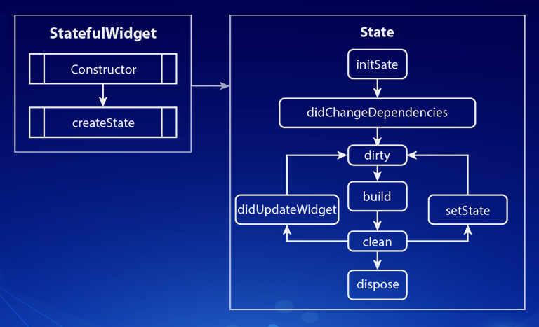

# Flutter Widget Lifecycle

</img>

<p>
    Like app lifecycle, widgets in flutter also have lifecycle methods associated with them. In this repo, we will take a look at Widget lifecycle methods in flutter. Everything in Flutter is a widget, so before thinking about Lifecycle, we should think about Widgets in Flutter.<br> Flutter has majorly two types of widgets:
</p>

```
1. Stateless Widgets
2. Stateful Widgets
```

## Stages Of Widget Lifecycle

</img>

Widgets in Flutter have following lifecycle methods associated with them:

1. createState :

```
This method is called when we create another Stateful Widget. It is an obligatory strategy.
The createState() returns a case of a State-related with it.
```

2. initState :

```
This method is called when this object is inserted into the tree.This will be called exactly
once per State object. Here we can initialize our variables, objects, streams,
AnimationController, and so on.
```

3. build :

```
This method is called every time the widget is rebuilt. This can be after call to initState(),
didChangeDependencies(), didUpdateWidget() or when the state is changed via call to setState.
```

4. didChangeDependencies :

```
This method is called immediately after initState() and when dependency of the State object 
changes via InheritedWidget.
```

5. didUpdateWidget :

```
This method is called whenever the widget configuration changes. A typical case is when a parent passes
some variable to the children widget via the constructor.
```

6. setState :

```
The setState() method illuminates the framework that the internal state of this item has changed in a manner
that may affect the UI which makes the structure plan a build for this State of the object.
```

7. deactivate :

```
This method is called when the object is removed from the tree.
```

8. dispose :

```
This method is called when this object is removed from the tree permanently. Here we should release 
any resources retained by this object like stopping animation for instance. One example when this method is called
is while using the pushReplacement() of the Navigator to replace the current widget with a new one.
```

# Video

<p>For for information regarding the Widget Lifecycle, watch this video</p>
 
[YouTube](https://www.youtube.com/watch?v=FL_U8ORv-2Q)
